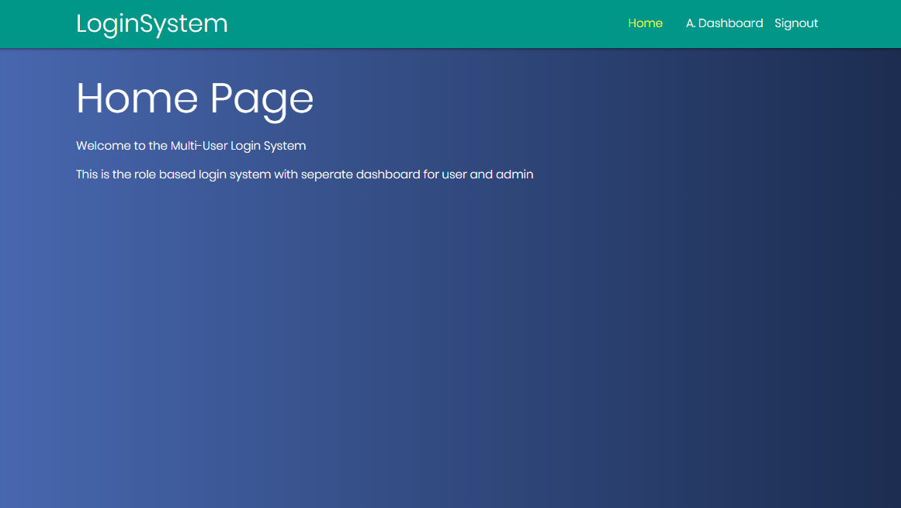
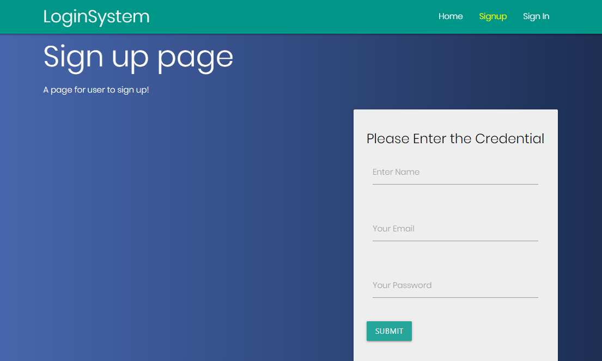
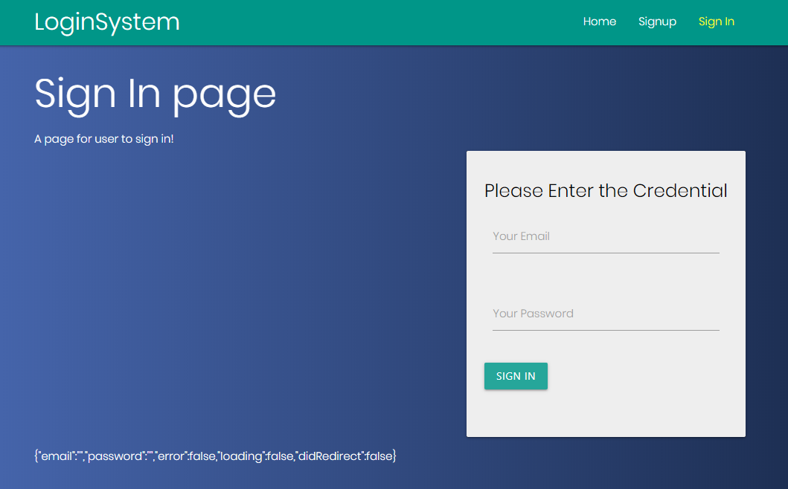
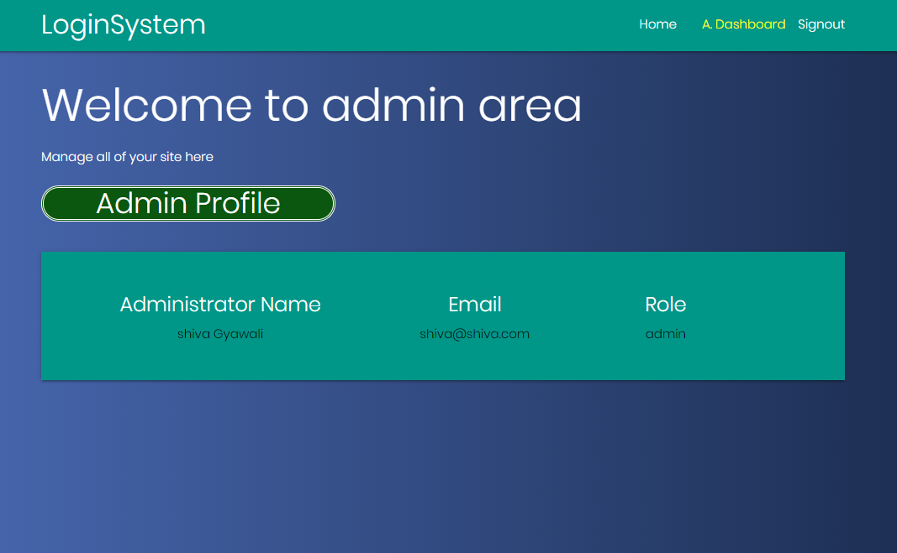
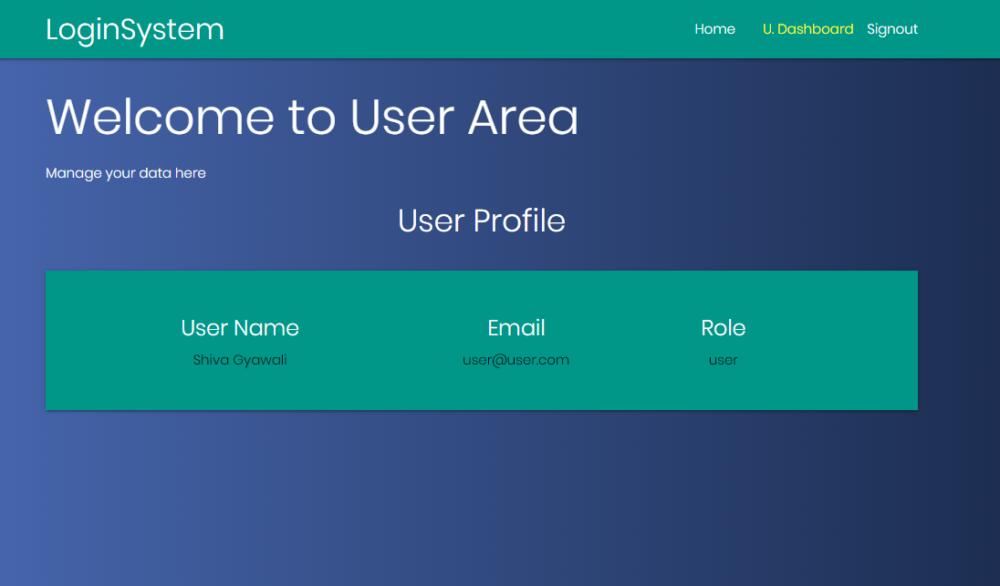

# mern-stack

Another boilerplate code for getting started with MERN stack User and Admin Authentication System.

## ScreenShot







## Introduction

This is an example generic code to help you (and me) to get started with the MERN (MongoDB, ExpressJS, ReactJS and NodeJS) stack.

- M ongoDB - https://www.mongodb.com/
- E xpressJS - https://www.expressjs.com/
- R eactJS - https://facebook.github.io/react/
- N odeJS - https://nodejs.org/en/

As well as:

- MaterializeCss - https://materializecss.com/
- crypto-js - https://www.npmjs.com/package/crypto-js
- express-jwt - https://www.npmjs.com/package/express-jwt
- express-validator - https://express-validator.github.io/docs/
- formidable - https://www.npmjs.com/package/formidable
- jsonwebtoken - https://www.npmjs.com/package/jsonwebtoken
- mongoose - https://mongoosejs.com/
- nodemon - https://www.npmjs.com/package/nodemon
- lodash - https://www.npmjs.com/package/lodash
- uuid - https://www.npmjs.com/package/uuid

## Install

On this step you should be able to run the project typing:

```
  git clone https://github.com/shivagyawali/MERN-LoginSystem
  cd MERN-LoginSystem/projbackend
  npm install
  cd ..
  cd MERN-LoginSystem/projfrontend
  npm install
```

## Build the react

```
  MERN-LoginSystem/projfrontend
  npm start
```

## Run the development server

```
  MERN-LoginSystem/projbackend
  npm start
```

## Environment Variable for FrontEnd

Create .env file in projfrontend folder and follow below :

MERN-LoginSystem/projfrontend

```
  REACT_APP_BACKEND=http://localhost:5000/api/

```

## Environment Variable forBackEnd

Create .env file in projbackend folder and follow below :

MERN-LoginSystem/projbackend

```
  DATABASE=mongodb://localhost:27017/mernStacklogin
  PORT=5000
  SECRET=YOUR_APP_SECRET

```

## Code of Conduct

please review and abide by the [Code of Conduct]).

## Security Vulnerabilities

If you discover a security vulnerability within this application, please send an e-mail to Shiva Gyawali via [gyawalishiva@yandex.com](mailto:gyawalishiva@yandex.com). All security vulnerabilities will be promptly addressed.

## License

The application is open-sourced software licensed under the [MIT license](https://opensource.org/licenses/MIT).
